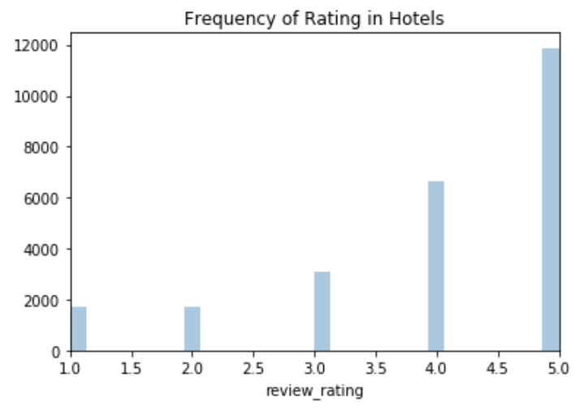
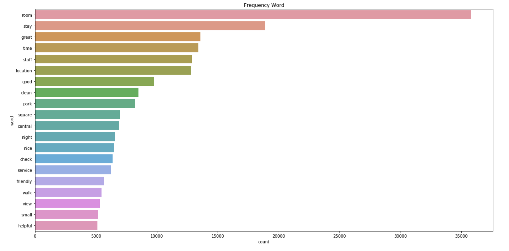
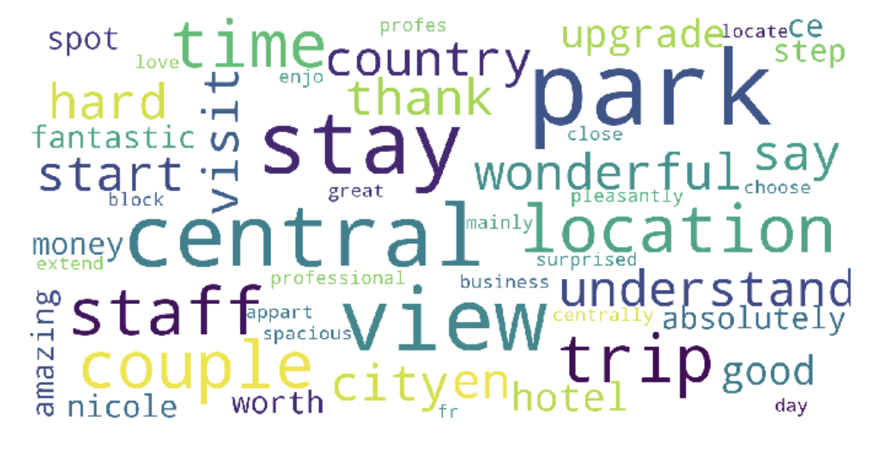
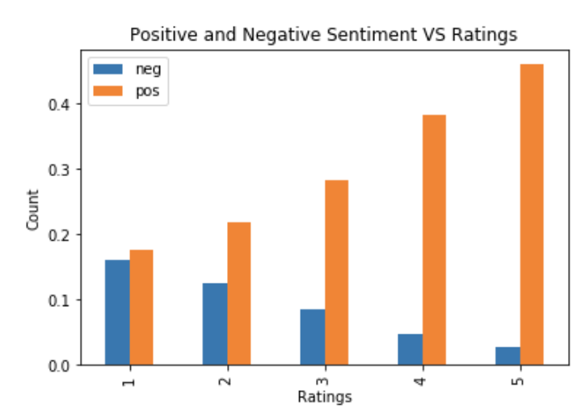
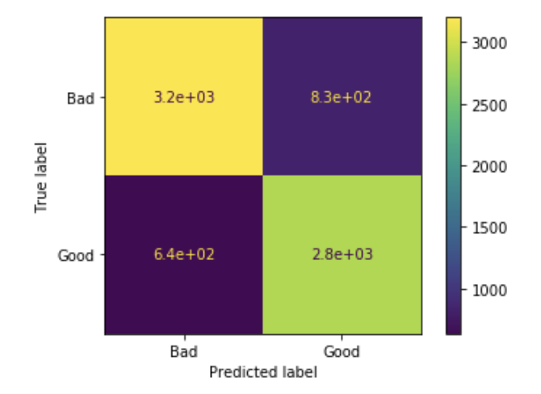

# Text Classification And Sentiment Analysis On Hotel Reviews

## Goal
The focus of this study is training supervised learning text classification models to see whether or not its possible to predict reviews ratings. The dataset was scraped from TripAdvisor and contained the name of a person leaving a review, the actual user review and the rating from the top ten rated hotels. After tokenizing, lemmatize and filtering the data, I vectorized the reviews first with the term frequency-inverse document frequency (tf-idf) method, which provides insight to the weight of each word in each document and also with count vectorizer that transforms the text in vectors of the tokens counts. 

## Data Collection
I scraped the data from the TripAdvisor website using Beautifull Soup and Selenium libraries. The dataset contains the reviews, users and ratings from hotels in TripAdvisor located in New York. The data set has 25,050 entries.

## Exploratory Data Anlaysis (EDA) 

Most of the reviews have a 5 stars that is 47% of the data. Only 7% of reviews have 1 star. 

There are 22,205 unique reviews in the data which is quite diverse. The average user has contributed with 1 review to the dataframe. The top reviewer (Marck C) has contributed 13 reviews.

The maximum number of characters in a review is 2,535 and the minimum number is 195 characters. The average length of characters in a review is 469 characters.

## Data Preprocessing / Feature Engineering

Given clean data, I used Spacy to tokenize, lemmatize and filter the data. I have vectorized the reviews with term frequency-inverse document frequency (tf-idf) values, which provided insight to the weight of each word in each document and also with Word Count vectorizer.

## Visualization of Word Frequecies and Wordcloud

## Sentiment Analysis

The graph below shows the comparison of negative and positive sentiment scores and the ratings of the reviews. The negative sentiment score decreased from one to five ratings. On the other hand, the positive sentiment score increased from one to five ratings. In an ideal case, reviews with ratings of one and two would have a much higher percentage of negative sentiment than positive sentiment. However, this graph shows that rating one has a higher percentage of a positive sentiment score than a negative score. We can also see this with rating number two.

## Performance of ML Models
I trained the following classifications algorithms: Logistic Regression, Decision Tree, Random Forest, Gradient Boosting, Adaboost, XGBoost, Linear Support Vector Classification and Multinomial Naive Bayes. Afterwards, I will tune the parameters of the models to maximize the model performance using a combinatorial grid search. 

For this particular dataset the TF-IDF vectorization performs better than the word count method. Binary classification demonstrated the best approach for this project. After testing all the classifiers, the one with higher accuracy score was Support Vector Machine which achieved a 87% accuracy rate after tuning the parameters. 

